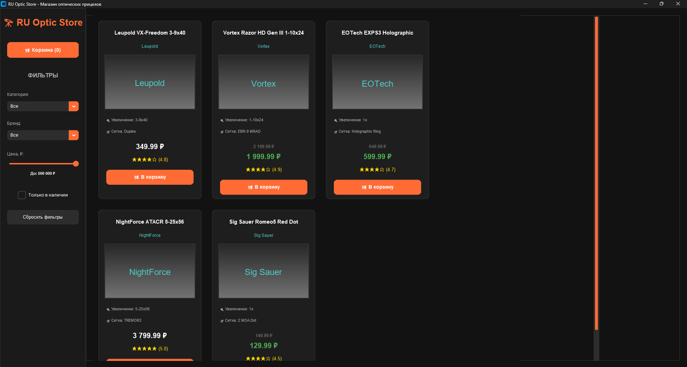
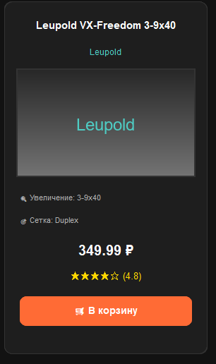
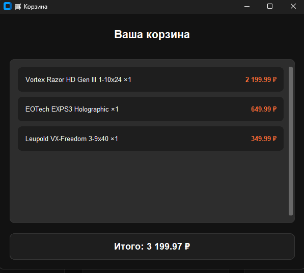

# 🔭 RU-OpticStore by PRAVDA_SEMPAI

[](https://www.python.org/)
[](https://fastapi.tiangolo.com/)
[](https://customtkinter.tomschimansky.com/)
[](https://www.sqlite.org/)
[](https://opensource.org/licenses/MIT)

**Современный магазин оптических прицелов** с клиент-серверной архитектурой, разработанный как демонстрационный проект для портфолио.

## 📋 Основные возможности

### 🛍️ Frontend
- **Современный интерфейс** на CustomTkinter с темной темой
- **Адаптивная сетка товаров** с симметричными карточками
- **Расширенная фильтрация** по категориям, брендам, цене и наличию
- **Корзина покупок** с динамическим обновлением
- **Оформление заказов** с валидацией данных
- **Асинхронная загрузка** изображений товаров
- **Отображение цен в рублях** с форматированием

### ⚙️ Backend
- **REST API** на FastAPI с полной документацией
- **SQLite база данных** с SQLAlchemy ORM
- **Автоматическая инициализация** тестовых данных
- **CORS поддержка** для кроссплатформенной работы
- **CRUD операции** для товаров и заказов
- **Система инвентаризации** с учетом остатков

### 🎨 Дизайн и UX
- **Кастомная цветовая палитра** в современном стиле
- **Темная тема** с акцентными оранжевыми элементами
- **Анимации и эффекты** при наведении
- **Адаптивная верстка** под разные разрешения
- **Интуитивная навигация** между разделами
- **Визуальная обратная связь** при действиях

## 📸 Скриншоты

### Главный экран магазина


### Карточки товаров


### Окно корзины


## 🚀 Установка и запуск

### Требования
- Python 3.8+
- pip (менеджер пакетов Python)

### Установка зависимостей

```bash
# Установка зависимостей для бэкенда
cd backend/app
pip install -r requirements.txt

# Установка зависимостей для фронтенда
cd ../../frontend
pip install -r requirements.txt
```

### Запуск проекта
## 1. Запуск сервера (Backend)
```bash
cd backend/app
uvicorn app.main:app --reload --host 0.0.0.0 --port 8000
```

## 2. Запуск клиента (Frontend)
```bash
cd frontend
python main.py
```
## 📱 Соцсети
[[YouTube](https://www.youtube.com/@pravda_sempai)
[[Rutube](https://rutube.ru/channel/41737058/)
[[VK](https://vk.com/pravdasempai)
[[Telegram](https://t.me/PRAVDASEMPAI)
